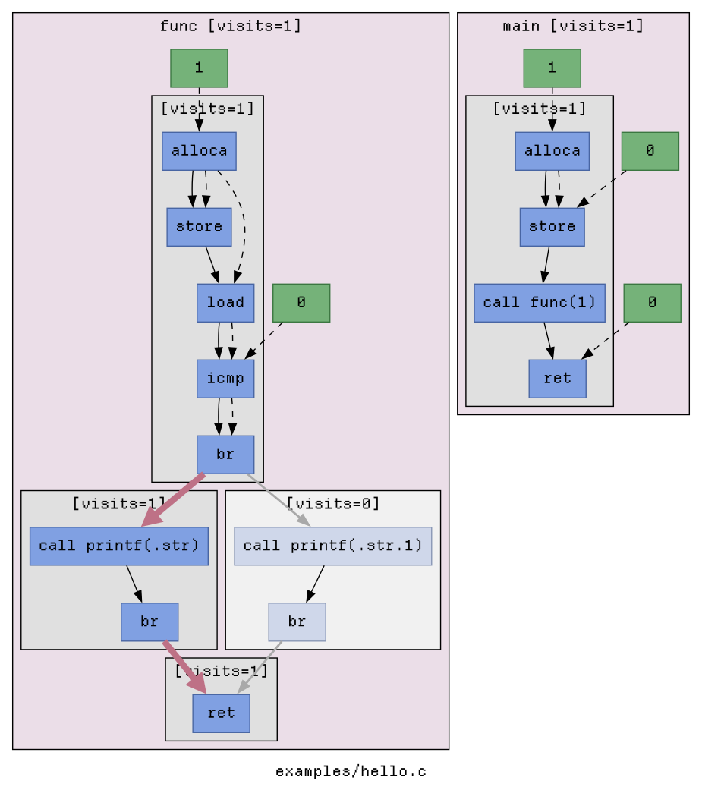
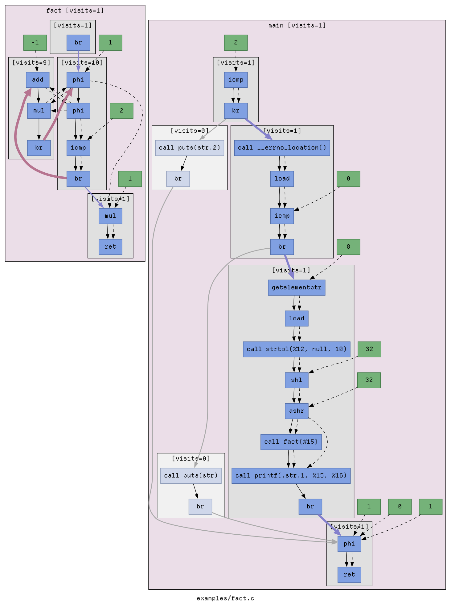

LLVM Pass for GraphViz control-data flow
----------------------------------------

### Build
```sh
make build
````

### Trace

Compiling with this pass emits `dot` syntax for the program's flow and injects
runtime hooks for graph enrichment.

One-shot flow:

```sh
./graphpass trace --name fact examples/fact.c -- 10
xdot out/fact/fact.runtime.dot
```

Step-by-step flow:

```sh
./graphpass compile --name fact examples/fact.c
./graphpass run out/fact -- 10
./graphpass enrich out/fact
xdot out/fact/fact.runtime.dot
```

### Graph kinds

This project produces two graph views:

- **Static graph** &mdash; emitted at compile time from LLVM IR. It shows the program structure only.
- **Runtime-enriched graph** &mdash; regenerated from the static manifest plus a runtime execution log. It preserves the same structure and overlays execution frequency and reachability.

### Runtime graph semantics

The runtime-enriched graph keeps the same structure as the static graph and adds execution information:

- **Functions**
  - Functions that were never reached are dimmed.
  - Reached functions show a visit count in the cluster label.
  - Function cluster color reflects how often the function was entered relative to other functions in the module.

- **Basic blocks**
  - Basic blocks that were never reached are dimmed.
  - Reached basic blocks show a visit count in the cluster label.

- **Intra-block edges and immediates**
  - Data edges, instruction ordering edges, and immediate-value nodes keep their static meaning and layout.
  - They are not used to encode runtime frequency.

- **Inter-block control-flow edges**
  - These edges encode runtime traversal.
  - **Thickness** reflects how often the edge was taken relative to other control-flow edges in the same function.
  - **Color** reflects how often the edge was taken relative to all recorded control-flow edges in the module:
    - gray: never taken
    - blue: colder / less frequent
    - red: hotter / more frequent

### Static graph examples

<table>
  <tr>
    <td align="center" style="vertical-align: top;">
      
    </td>
    <td align="center" style="vertical-align: top;">
      
    </td>
  </tr>
  <tr>
    <td align="center" valign="top">
      <code>clang -fpass-plugin=./graphPass.so examples/hello.c -O0 | dot</code>
    </td>
    <td align="center" valign="top">
      <code>clang -fpass-plugin=./graphPass.so examples/fact.c -O1 | dot</code>
    </td>
  </tr>
</table>

### Runtime graph examples

<table>
  <tr>
    <td align="center" style="vertical-align: top;">
      
    </td>
    <td align="center" style="vertical-align: top;">
      
    </td>
  </tr>
  <tr>
    <td align="center" valign="top">
      <code>./graphpass trace --name hello --opt=-O0 examples/hello.c</code>
    </td>
    <td align="center" valign="top">
      <code>./graphpass trace --name fact --opt=-O1 examples/fact.c -- 10</code>
    </td>
  </tr>
</table>
