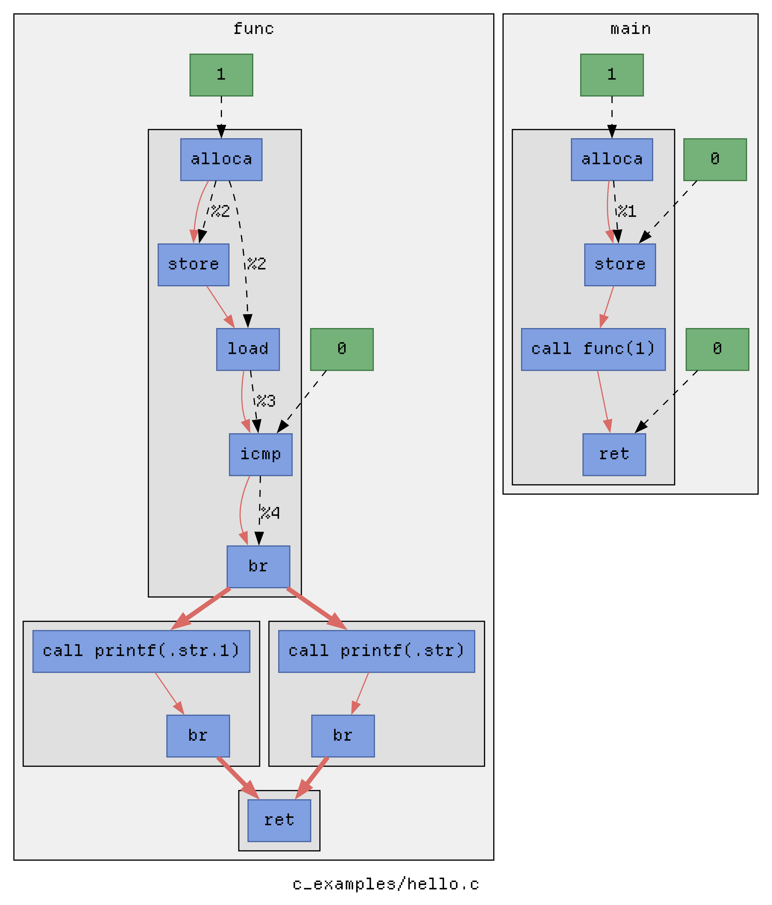
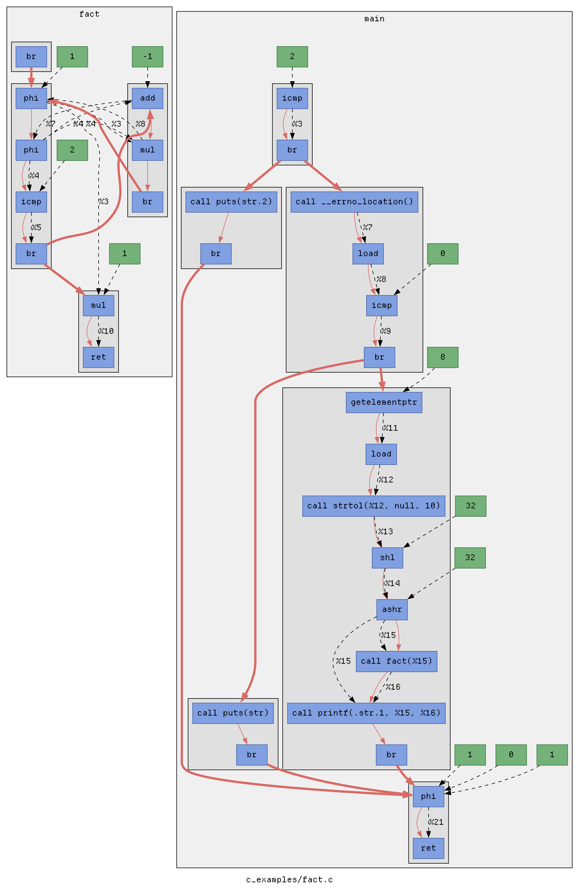

LLVM Pass for GraphViz control-data flow
----------------------------------------

### Build
```sh
make build
````

### Run

Compiling with this pass will emit `dot` syntax for the program's flow, and
inject runtime hooks for graph enrichment.

```sh
make graph EXAMPLE=fact OPT=-O1
make run EXAMPLE=fact ARGS=10
make enrich EXAMPLE=fact
xdot ./out/fact/fact.runtime.dot
```

### Examples

<table>
  <tr>
    <td align="center" valign="middle">
      
    </td>
    <td align="center" valign="middle">
      
    </td>
  </tr>
  <tr>
    <td align="center" valign="top">
      <code>clang -fpass-plugin=./graphPass.so examples/hello.c -O0 | dot</code>
    </td>
    <td align="center" valign="top">
      <code>clang -fpass-plugin=./graphPass.so examples/fact.c -O1 | dot</code>
    </td>
  </tr>
</table>
